# Team: CodeCarnivores 🦁
# SentinelZero: The Guardian Extension 🛡️


## Problem Statement

Rural and elderly banking users are increasingly targeted by **"Digital Arrest"** scams and **Vishing** (Voice Phishing). Scammers use psychological pressure to coerce victims into transferring money to "Mule Accounts" (accounts used for laundering).

Existing bank security focuses on *login* (passwords/OTPs) but fails to detect **psychological coercion** during the actual transaction. Once the OTP is shared, the money is gone.

There is a critical need for a **Client-Side Guardian** that sits *on top* of the banking interface to detect "Mule Accounts" and "High-Hesitation" behavior in real-time.

---

## Project Objective

SentinelZero (Internal Codename: **Sahayak**) is a browser extension that acts as an intelligent overlay on banking websites.

The platform aims to:
- **Detect Mule Accounts:** Instantly flag destination accounts against a trained ML database of known fraud patterns (95% Accuracy).
- **Behavioral Biometrics:** Analyze cursor movement and typing speed to detect "High Hesitation"—a key sign that a user is being coerced or coached over a call.
- **Secure Pay Prompt:** Intercept the transaction button to show a final "Intelligence Report" before money leaves the wallet.
- **Regional Support:** Provide warnings in local languages (Hindi/Tamil) to break the scammer's psychological hold.

---

## Sustainable Development Goals (SDGs)

This project aligns with the following United Nations Sustainable Development Goals:

### SDG 1: No Poverty
- **Target 1.4:** Protects the life savings of vulnerable populations (elderly, rural users) from devastating financial fraud, preventing them from falling into poverty due to scams.

### SDG 8: Decent Work and Economic Growth
- **Target 8.10:** Strengthens the capacity of domestic financial institutions to encourage and expand access to banking by building trust in digital infrastructure.

### SDG 9: Industry, Innovation, and Infrastructure
- **Target 9.5:** Enhances scientific research and upgrades technological capabilities by deploying resilient, privacy-preserving AI security layers for the financial sector.
---

## Proposed Solution

SentinelZero uses a **"Guardian Extension" Architecture**. Unlike bank-side systems that are slow to update, our extension patches security vulnerabilities immediately on the client side.

### Architecture & Workflow:

```mermaid
graph LR
    %% 16:9 Ratio Setup
    User(🧓<br>Elderly User) -->|Visits Bank| Ext[🧩 Extension<br>Activates];
    
    subgraph "Client-Side Guardian"
        Ext -->|Monitor| Mouse(🖱️ Mouse Jitter);
        Ext -->|Monitor| Keys(⌨️ Typing Speed);
    end
    
    Mouse & Keys -->|Data| AI{🤖 AI Engine};
    
    AI -->|Check Account| DB[(🗄️ Mule Database)];
    
    DB -- Match Found! --> Block{🛑 BLOCK};
    AI -- High Hesitation --> Block;
    
    Block -->|Trigger| Popup[📱 Sahayak<br>Warning Popup];
    
    style Block fill:#ff9999,stroke:#cc0000,stroke-width:2px
    style Popup fill:#e6ffe6,stroke:#009900,stroke-width:2px,stroke-dasharray: 5 5
```



1.  **User Visits Bank Site:** The extension (`content.js`) activates automatically on known banking URLs.
2.  **Behavioral Monitoring:** The system tracks non-PII metrics like mouse jitter and typing delays (Hesitation Index).
3.  **Mule Check:** When a payee account number is entered, it is sent to our Python Backend (`server.py`) to check against the Mule Database.
4.  **Intervention:**
    * **Green Shield:** Account is safe.
    * **Red Shield:** Account is a known Mule or User is showing signs of coercion.
5.  **Sahayak Report:** A popup blocks the "Transfer" button, showing the risk level and potential loss amount in large, clear text.

---

## 🛠️ Technologies Used

- **Extension Core:** HTML, CSS, JavaScript (Manifest V3)
- **Backend Logic:** Python (Flask/FastAPI)
- **AI/ML Engine:** - **Mule Detection:** Pattern recognition model trained on fraud datasets.
    - **Behavioral Engine:** Anomaly detection for cursor/typing metrics.
- **Database:** MongoDB (for Mule Account Registry)
- **Security:** Zero-Knowledge Proof (Extension analyzes risk without storing user login credentials).

---

## 📸 System Visuals

### 1. The "Sahayak" Intelligence Report (Intervention)
*The extension overlays the banking site to warn the user of "High Hesitation" (Coercion Risk) and blocks the transfer.*


### 2. Mule Account Detection
*Real-time flagging of a suspicious account number before the user can click "Pay".*


---

## 🚀 How to Run the Prototype

### 1. Start the Backend Server
The Python server handles the ML inference for Mule Accounts.
```bash
pip install -r requirements.txt
python server.py
```
### 2. Load the Extension
1.  Open Chrome and navigate to `chrome://extensions/`.
2.  Toggle **Developer Mode** (Top Right corner).
3.  Click the **Load Unpacked** button.
4.  Select the `codecarnivores-main` folder from your system.
5.  Open the included `index.html` (Bank Simulation) in your browser to test the intervention logic live.

---

## Conclusion

SentinelZero proves that security doesn't need to be complex to be effective. By monitoring **human behavior** and **destination accounts** rather than just passwords, the "Sahayak" extension provides a critical safety net for the most vulnerable members of our digital society.
